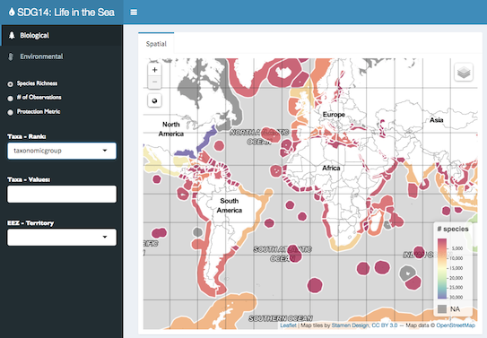
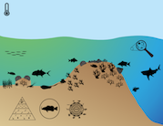
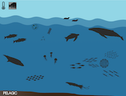

## Explorer

## Infographics

Welcome to the prototype tools site by the [Marine Biodiversity Observation Network](http://www.marinebon.org) (MBON) working to support the United Nations [Sustainable Development Goals](https://sustainabledevelopment.un.org) (SDGs), particularly SDG14 Life in the Sea. This work is supported by [NOAA](http://noaa.gov) and [NASA](http://nasa.gov).

For more background, check out the [MBON Products for SDGs presentation](https://docs.google.com/presentation/d/1bBbDWz9UuNZNv5dUzGqE6q-yS0ru6dGZmOyQLOVzt14/present) given at the [GEO Plenary side event](http://www.earthobservations.org/geo14.php?t=schedule) in Washington DC, 2017-10-24.

 We would love to help you make similar tools relevant to reporting on marine biodiversity for your region of interest. Please don't hesitate to get in touch with suggestions, comments or questions: <ben@ecoquants.com>.

